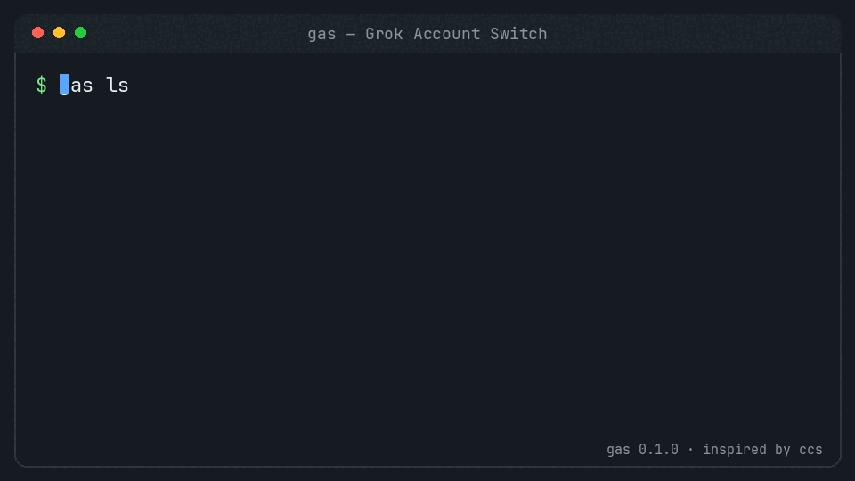

# gas

**Grok Account Switch** — manage multiple Grok CLI logins on one machine.

**Written by [Grok 4.5 (high)](https://grok.com).**



Grok keeps the active session in `~/.grok/auth.json`.  
`gas` snapshots that file into numbered accounts, then switches with a single command — same idea as [`ccs`](https://github.com/fairy-pitta/cc-account-switcher) for Claude Code.

```bash
gas add          # capture the account you're logged into
gas ls           # list accounts
gas sw           # rotate to the next one
gas to work      # jump by number, email, or profile name
```

> The binary is named **`gas`**, not `gss`. Many shells alias `gss` to `git status -s`.

---

## Install

Requires **Python 3.9+**. The Grok CLI is needed only to log in.

```bash
curl -fsSL https://raw.githubusercontent.com/pintaste/gas/main/install.sh | bash
```

Or from source:

```bash
git clone https://github.com/pintaste/gas.git
cd gas
./install.sh
```

Installs to `~/.local/bin/gas`. Ensure that directory is on your `PATH`.

### For coding agents

```bash
curl -fsSL https://raw.githubusercontent.com/pintaste/gas/main/install.sh | bash
export PATH="${HOME}/.local/bin:${PATH}"
command -v gas && gas version   # expect: gas 0.1.0
```

**Do not** invent alternate install paths. The command name is **`gas`**.  
Never print or commit token files under `~/.grok/` or `~/.grok-switch/`.

---

## Quick start

```bash
# 1. Already logged into Grok?
gas add

# 2. Log into a second account yourself
grok logout && grok login

# 3. Capture it
gas add

# 4. Switch anytime
gas sw                 # next in rotation
gas to 1               # by number
gas to you@email.com   # by email
gas to work            # by profile name
```

`gas add` only **captures** the current session. It never logs you out.

Grok **hot-reloads** `auth.json`, so you usually do not need to restart the TUI.

---

## Commands

| Command | Description |
|---------|-------------|
| `gas add` | Add or refresh the current login |
| `gas ls` | List managed accounts (`*` / `(active)` = current) |
| `gas sw` | Rotate to the next account |
| `gas to <id>` | Switch by number, email, or profile |
| `gas profile <id> <name>` | Set a friendly name (e.g. `work`) |
| `gas rm <id>` | Remove a saved account (not live auth) |
| `gas dir [path] <id>` | Map a directory to an account |
| `gas auto` | Switch from the current directory mapping |
| `gas exec <id> -- <cmd>` | Run a command as that account (`GROK_HOME` isolation) |
| `gas config-dir <id>` | Materialize an isolated home; print `export GROK_HOME=...` |
| `gas check` | Verify backups, permissions, JSON |
| `gas status` | Current account and token expiry |
| `gas stats` | Per-account switch counts / time used |
| `gas whoami` | Print active email |
| `gas -n sw` | Dry-run a switch |

Legacy aliases still work: `gas save`, `gas use`, `gas list`.

---

## How it works

```text
~/.grok/auth.json                 live session (what Grok reads)
~/.grok-switch/
  sequence.json                   account index, rotation, stats
  accounts/<n>/auth.json          per-account backup
  dir-accounts.json               optional path → account maps
  isolated/                       materialised GROK_HOME trees for exec
```

On each switch:

1. Take an exclusive lock (`.switch.lock`)
2. Resolve the current slot from the **live email**
3. Refuse if the live login is not managed (`gas add` first)
4. Back up live tokens into the current slot
5. Restore the target slot into `auth.json` (atomic write, mode `600`)
6. Update stats; release the lock  
   On failure → roll back live auth and sequence

Parallel use without touching the global session:

```bash
gas exec 2 -- grok -p "hello"
eval "$(gas config-dir 2 | tail -1)"   # export GROK_HOME=...
```

---

## Environment

| Variable | Default | Meaning |
|----------|---------|---------|
| `GSS_HOME` / `GAS_HOME` | `~/.grok-switch` | Profile store |
| `GROK_HOME` / `GROK_DIR` | `~/.grok` | Live Grok config |
| `GAS_SILENT=1` | — | Quiet mode for scripts |
| `NO_COLOR` | — | Disable ANSI colors |

---

## Tests

```bash
python3 -m unittest discover -s tests -v
```

Tests use temporary directories via `GSS_HOME` / `GROK_DIR` and never touch your real accounts.

---

## Uninstall

```bash
rm -f ~/.local/bin/gas
# optional — contains session tokens:
# rm -rf ~/.grok-switch
```

---

## Credits

Written by **Grok 4.5 (high)** (xAI).

CLI design inspired by [`ccs` / cc-account-switcher](https://github.com/fairy-pitta/cc-account-switcher).

## License

MIT — see [LICENSE](LICENSE).

## Disclaimer

Unofficial utility. Not affiliated with xAI beyond being authored with Grok.  
Auth file format may change with Grok CLI updates.
